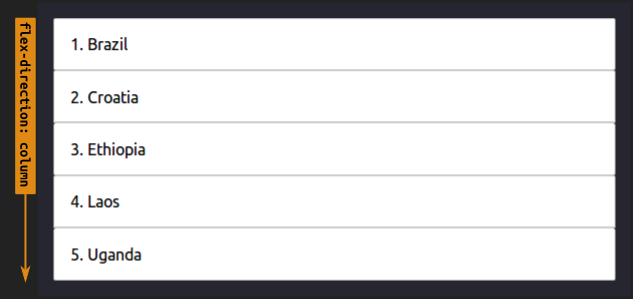
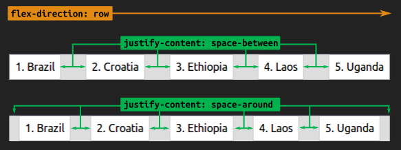
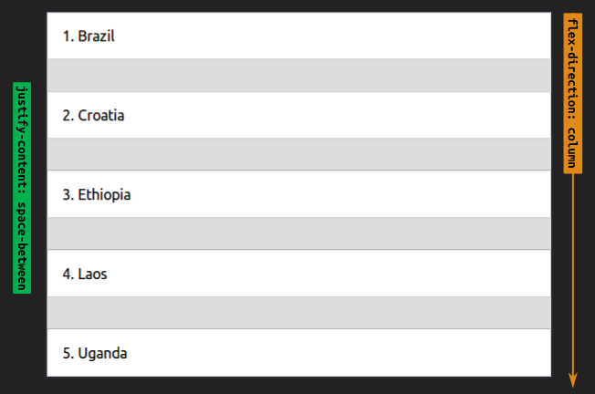
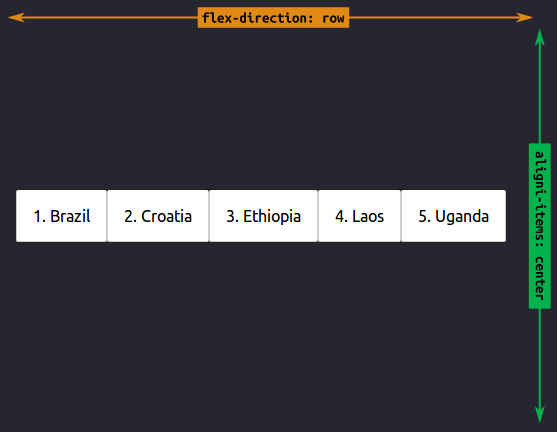
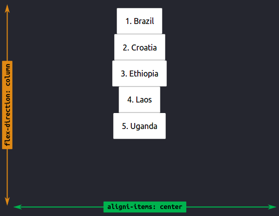

# HTML/CSS 2

**What will we learn today?**

* [Responsive web design](#responsive-web-design)
* [Media queries](#media-queries)
* [Flexbox](#flexbox)

---

## Responsive Web Design

When we build for the web, we're making websites that can be viewed in a phone, a laptop, a tablet and more. To ensure we're presenting a website that's easy to use on any device, we use Responsive Web Design techniques to modify how content is displayed depending on the viewport.

> **Exercise:** As a group, let's brainstorm as many devices as we can think of which might access the websites we build.

See how much variety there is in [viewport sizes](https://decadecity.net/blog/2014/08/19/a-device-agnostic-approach-to-inlining-css).

## Media Queries

As you learned in your homework assignment, media queries help us change the display of our content depending on the size of the viewport. Let's review what you learned and break down a media query:

```css
@media screen and (min-width: 900px) {
  body {
    background: red;
  }
}
```

In this media query, we're assigning a red background color to the `<body>` element whenever the viewport is larger than `900px`, and we're viewing on a screen.

* `@media` starts the media query
* `screen` tells it to apply these styles to screen displays. Other displays
  might be `print`, for when a webpage is being printed.
* `(min-width: 900px)` tells it to apply these styles when the viewport is
  larger than `900px`

Finally, we wrap all of our styles for this media query in brackets (`{` and `}`), just like a CSS rule.

## Flexbox

Flexbox allows you to arrange things on a webpage.
These can be buttons, `<div>` elements, paragraphs, anything you want!

To add flexbox:
  1. Identify the elements you want to arrange in a certain way. Let's use this for now:
  ```html
    <button>Home</button>
    <button>Gallery</button>
    <button>Contact</button>
  ```
  2. Make sure they're part of the same container:

```html
    <div class="menu">
      <button>Home</button>
      <button>Gallery</button>
      <button>Contact</button>
    </div>
  ```

  3. Tell the container to use Flexbox to arrange all its children

```css
.menu {
  display: flex;
}
```

Once you have flexbox applied to the container you can start adding more rules to tell it exactly how the elements should be arranged.

**`flex-direction`**

*Display elements on a row*

```css
.menu {
  display: flex;
  flex-direction: row;
}
```


*Display elements in a column*

```css
.menu {
  display: flex;
  flex-direction: column;
}
```



**`justify-content`**

*Space out elements equally on a row*
```css
.menu {
  display: flex;
  flex-direction: row;
  justify-content: space-between; /* OR space-around */
}
```



*Space out elements equally in a column*
```css
.menu {
  display: flex;
  flex-direction: column;
  justify-content: space-between; /* OR space-around */
}
```



**! Important !** In the above 2 examples we used the exact same rule `justify-content: space-between;` BUT we changed the `flex-direction` to `row` and then `column`. Notice how `justify-content` works in the same direction as `flex-direction`. So in the above two images, the "green" arrow for `justify-content` is operating in the same direction `flex-direction`.

**`align-items`** 

*Align elements on a row*
```css
.menu {
  display: flex;
  flex-direction: row;
  align-items: center;
}
```



*Align elements on a column*
```css
.menu {
  display: flex;
  flex-direction: column;
  align-items: center;
}
```



**! Important !** While `justify-content` works on the same direction as `flex-direction`, `align-items` works the opposite way! Have a close look at the above images - the "green" arrow is opposite to the yellow `flex-direction` one.


Here is a really easy to read, visual and complete reference to the different kinds of properties you can use with flexbox and their values:
[https://css-tricks.com/snippets/css/a-guide-to-flexbox/](https://css-tricks.com/snippets/css/a-guide-to-flexbox/)